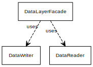

# Klassen Diagramm

Klassen Diagramm in kompletter Form

## Users

In diesem Diagramm sehen wir das detailiert Klassen Diagramm für die User unseres Tools.

Wir haben für die Benuzter eine Abstrakte Klasse "User", welche von den Klasen "Patient" und "Artzt" geerbt wird.
Die Klasse Artzt hat zusätzlich eine Referenz auf die Patienten Klasse. Das Ziel dabei ist, dass Ärtzte die Möglichkeit haben auf die Fortschritte ihrer Patienten zuzugreifen.

## Journal

In diesem Diagramm sehen wir die Details der Journal Klassen.

Das Ziel des Journal ist es, dass Patienten eine Art Tagebuch führen können. Dafür haben wir eine Journal Library Klasse welche die Journal Einträge speichert und zusätzliche funktionen bereitstellt.

## Challanges

Hier sehen wir die Details der Klassen die für die Challanges.

Auch für die Levels haben wir eine Level Library welche die einzelnen Levels speichert. Die Level Klasse soll die einzelnen Challanges speichern. Zusätzlich haben wir uns entschieden für die Level und Challange Klassen ein Observable Pattern zu verwenden. Ziel ist die Umkehrung der Abhängigkeit zwischen Level und Challange. Die Interfaces "Observer" und "Observable" werden durch das Java Framework bereitgestellt, diese müssen nur noch implementiert werden.

## Data Layer Klassen

